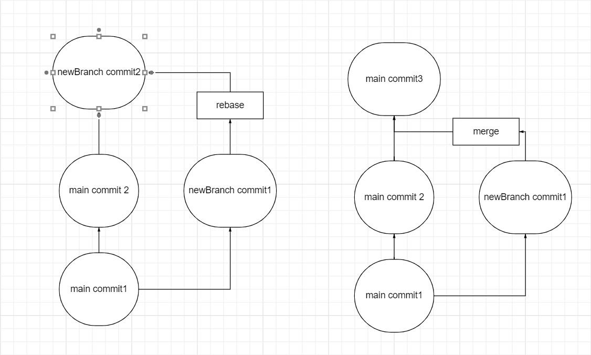

# ***Инструкция GIT*** #
## **Основные Термины**
 * **коммит** - версия файла
 * **ветка** - паралель создания файла позволяет создавать коммиты независимые друг от друга(можно работать разным людям над одним и тем же файлом)
 * **репозиторий** - папка инициализированная в гите(чисто технически это специальная скрытая папка .git)
 * **удаленный репозиторий** - репозиторий хранящийся в облаке GIT HUB(или других облачных сервисах контроля версий)
### для создания удаленного репозитория необходимо ознакомится с инструкцией облачного сервиса, обычно в таких сервисах есть подробная инструкция как связать удаленный репозиторий с локальным.
 * **клонирование** - это когда вы копируете удаленный репозиторий к себе на локальный ПК. Это то, с чего обычно начинается любой проект. (при клонировании удаленного репозитория не нужно инициализировать git в папке для клона, репозиторий скачивается в ходе клонирования)
## **Основные команды** ##
 * **_git status_** - команда позволяет проверить инициализирована ли папка 
 * **_git init_** - инициализация git в папке, создается скрытый файл .git, в котором сохраняются все данные о изменении файла, так же создает главную ветку master
 * **_git add_** - команда добавляет файлы с сохраненными изменениями к текущей ветке "коммитов" 
    - *git add* . - добавляет все файлы к коммитам
    - *git add namefile* - добавляет файл по имени namefile
* **_git commit_** - команда создает коммит из добавленных файлов (add)
    - *git commit -m "coment"* - создает коммит с коментарием 
    - *git commit --amend -m "coment"* - меняет коментарий последнего коммита
* **_git log_** - команда позволяет посмотреть все коммиты в данной ветке коммитов. 
    - *git log --all* - показывает все коммиты даже если вы находитесь не на последнем
    - *git log --all --oneline* - показывает все коммиты, при чем каждый коммит показывает в одной строке
    - *git log --graph* - показывает все коммиты с графическим изображением веток. 
* **_git checkout_** - команда позволяет переключатся между коммитами. 
    - *git checkout + первые 4 символа коммита* - преход на выбранный коммит (если мы создадим новый коммит из предидущих коммитов, то создается новая ветка!!!)
    - *git checkout master* - переход на актуальную версию файла в данной ветке. 
    - *git checkout name_branch* - переход на другую ветку гита с именем *name_branch*
* **_git branch_** - позволяет узнать на какой в ветке мы находимся, и так же показывает все ветки в данном файле 
* **_git diff_** - команда позволяет сравнить текущюю версию с последним коммитом
* **_git branch_** name_new_branch - creat new branch
* **_git merge_ name_branch** - слияние веток, обязательно из ветки куда сливать и пишем что сливаем. иначе потеряем ветку мастер
* **_git branch -d_ name_branch** - delete branch 
    - _git checkout -b_ name_branch - создание новой ветки с именем name_branch и переход на нее одной командой.
* **_git rebase_** - команда позволяет не просто обьединить ветки но и визуально переместить их одна за другой таким образом, что создается впечатление как буд-то коммиты создавалиьс последовательно.(rebase производится из ветки куда переносится вторая ветка, иначе потеряем коммиты в ветке мастер).

## Удаленный репозиторий основные команды
* **_git clone https://_ ссылка** - команда позволяет скопировать репозиторий из удаленного репозитория.
    - так же привзывает удаленный репозиторий к локальной папке дял работы с файлами
    - При скачивании репозитория командой _git clone_ скачивается весь репозиторий, именно для этого создается файл git ignor 
* **_git push_** - команда для отправки изменений и коммитов на удаленный репозиторий. Для этого необходимо привязать папку к удаленному репозиторию.
    - _git remote add origin(master)_ и ссылка на ваш репозиторий удаленный - команда привязывает локальный репозиторий к удаленномму(прописывается для каждого репозитория отдельно)
    - _git push -u_ название главной ветки(master или origin) - команда отправляет изменения и коммиты всех файлов локального репозитория.(все что внесено в git add и git commit). 
    - При отправке измененного файла на удаленного репозитория нужно проверить нет ли конфликтов в строках файла. 
* **_git pull_**- команда позволяет обновить файл из удаленного репозитория на локальный.
Так же команда позволяет проверить конфликты между удаленным репозиторием и локальным. Команда выдаст ту же картину что и обычный конфликт между коммитами. 
    - этот конфликт необходимо решить теми же способами что и обычный конфликт между коммитами локального репозитория.
* Так же можно работать только с Удаленным репозиторием на самом сайте сервиса, там реализованы теже возможности что и в локальном репозитории + возможно отправлять запрос к создателю файла о измененинях __Pull Request__

## Полезные ссылки ##
* [инструкция markdawn](https://gist.github.com/Jekins/2bf2d0638163f1294637#Parag)
### задание на устранение конфликтов при слиянии веток
* создаю строки для конфликта возможно от недостатка строк не выдает конфликт хотя поменял 5 строк
напишу белеберда или катука баррадука 
    * например вот так **_катука бараддука_**
 
* а тут напишу какую нибудь другую ерунду 
    * например курдулька барадулька лакака макака хотя не уверен что пишется раздельно 
потом опять git commit -a -m ""
* А вот и скриншот
* 

